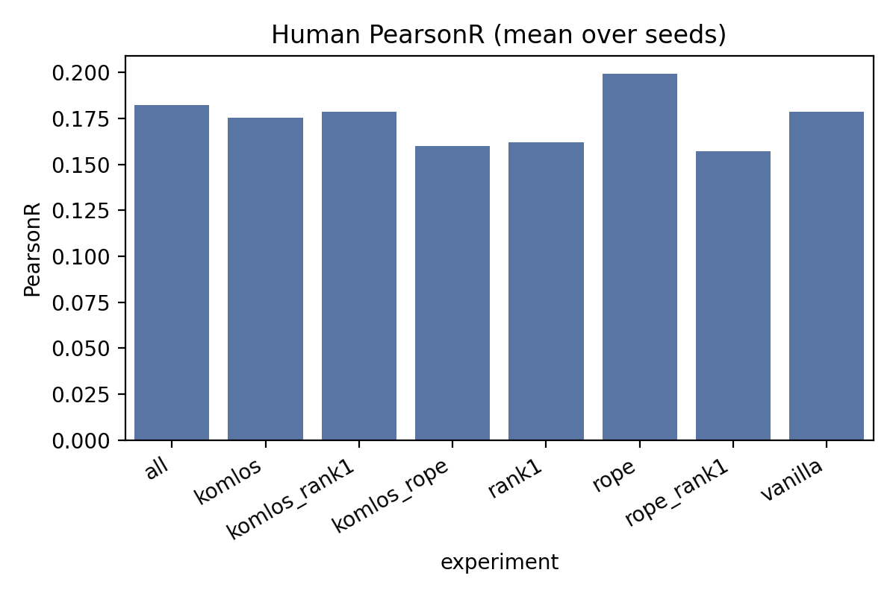
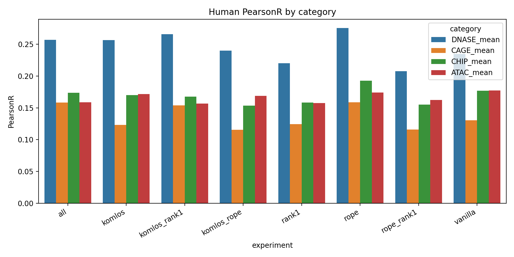
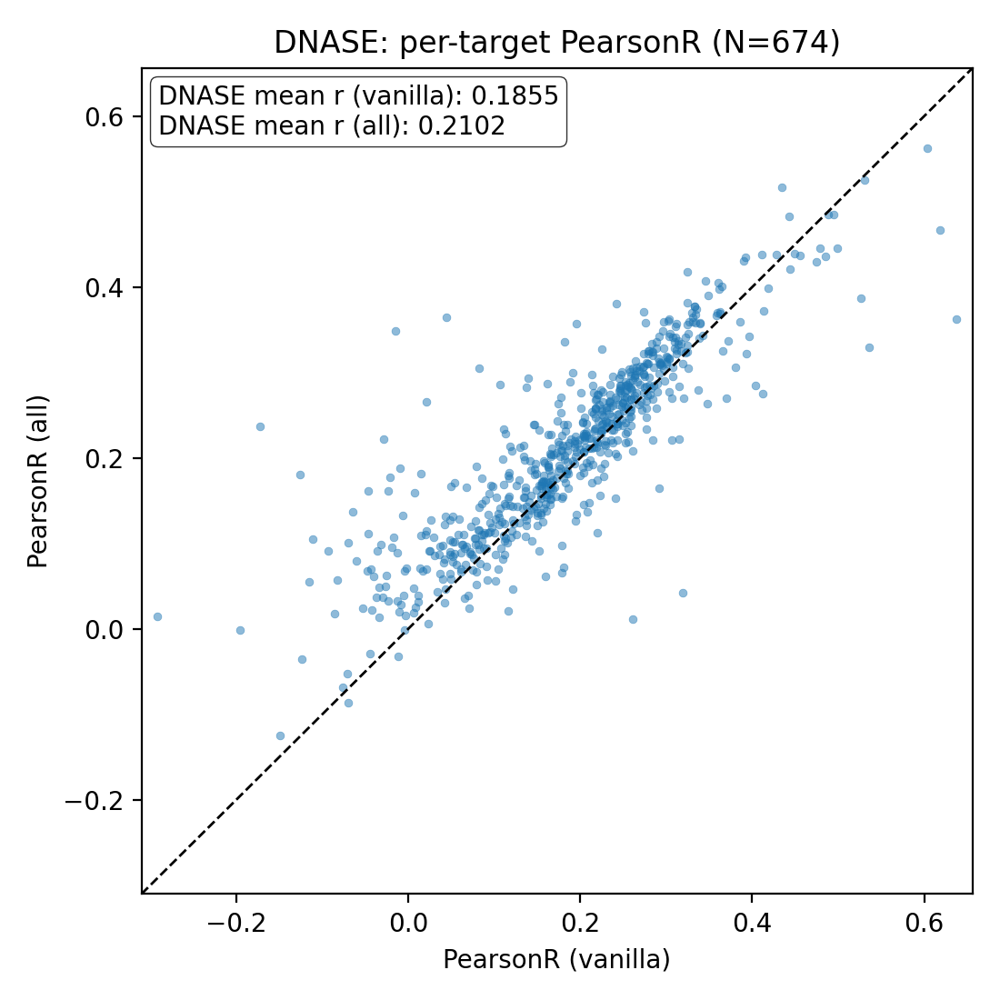
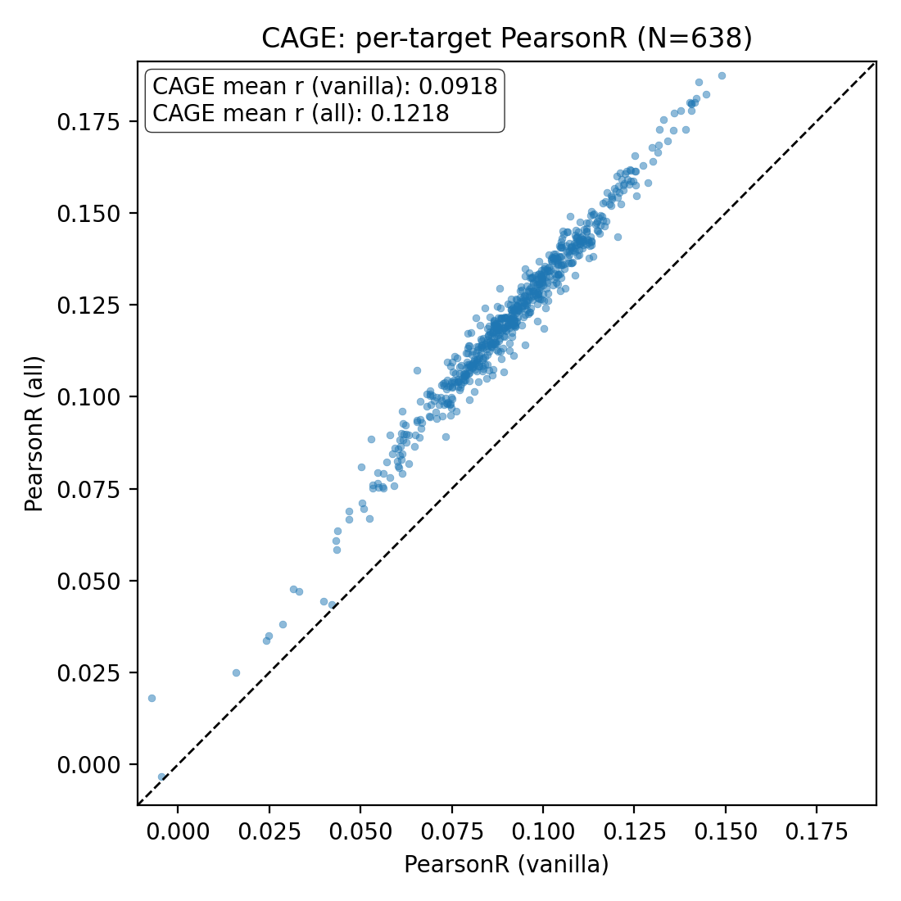
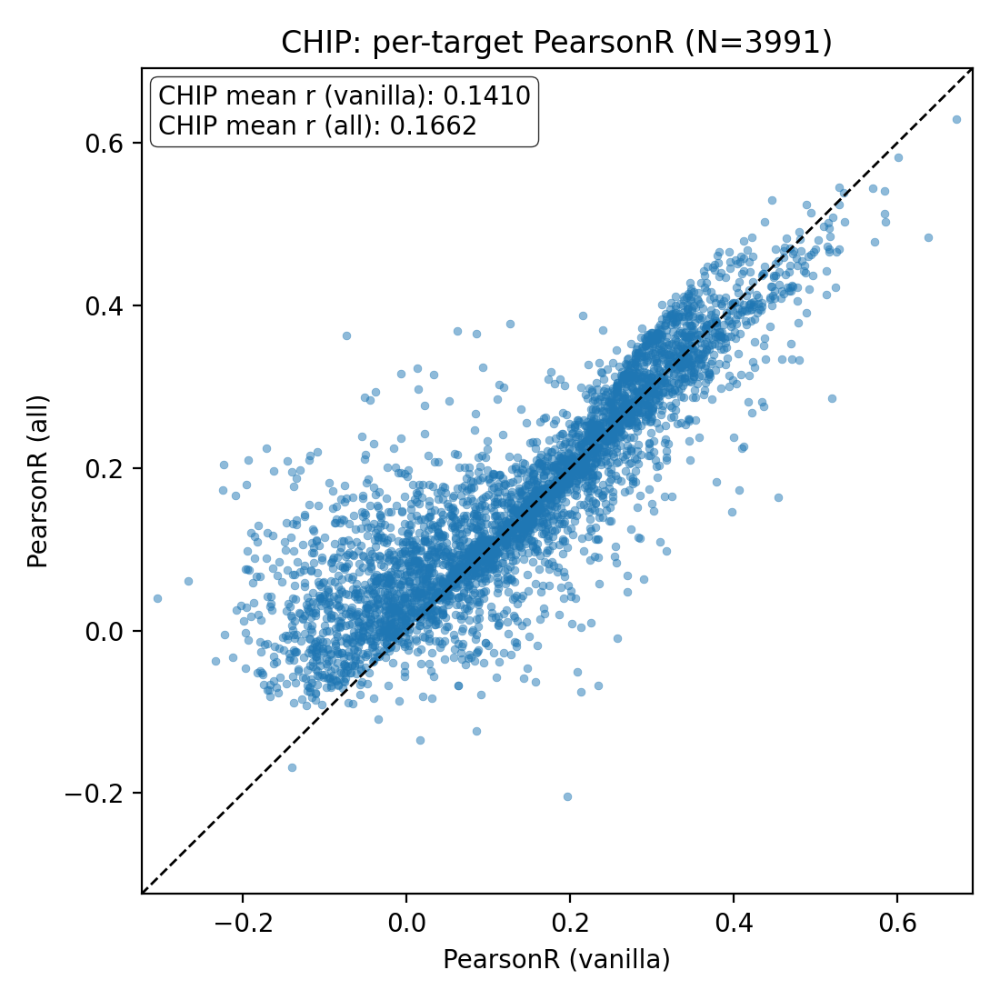
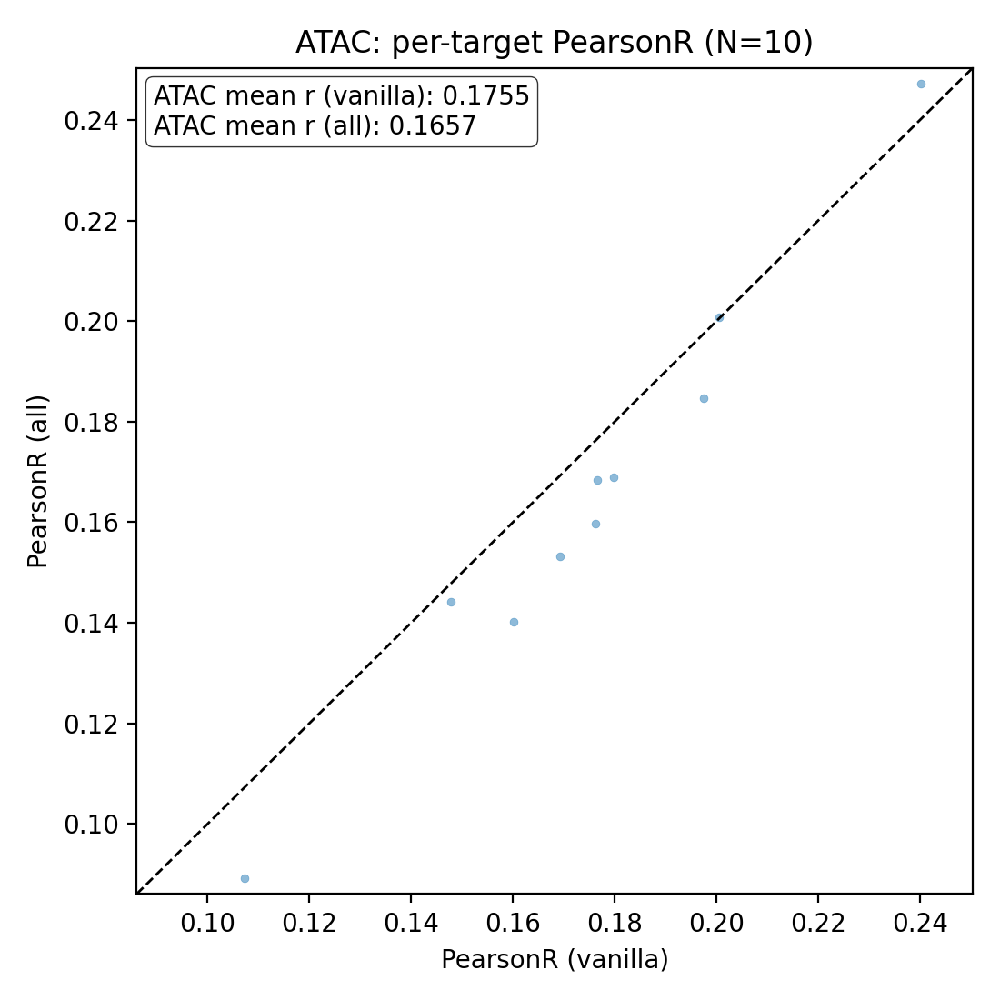

# 🧬 Ecozoi Experiments: Enformer Variants

[](https://python.org)
[](https://tensorflow.org)


> **Enformer Variants with Komlós, RoPE, and Rank-1 Modifications**

## 📋 Table of Contents

- [Overview](#-overview)
- [Model and Variants](#-model-and-variants)
- [Theory](#-theory-short-primers)
- [Data](#-data)
- [Training Protocol](#-training-and-evaluation-protocol)
- [Results](#-visualization)
- [Reproducibility](#-notes-and-reproducibility)
- [Citation](#-citation)

## 🎯 Overview
This repository implements and evaluates three orthogonal modifications to DeepMind's Enformer architecture:

| Modification | Description | Benefit |
|-------------|-------------|----------|
| **🧬 Komlós** | 3-channel balanced DNA encoding | Reduces redundancy, improves conditioning |
| **🔄 RoPE** | Rotary Positional Embeddings | Better long-range generalization |
| **📊 Rank-1** | Rank-1 value projection in attention | Parameter reduction, regularization |

**Performance Evaluation**: Pearson correlation (PearsonR) across 5,313 human assay tracks, with statistical stability through multiple random seeds.

### 🔑 Key Scripts
- **`run_experiments.py`**: End-to-end training, evaluation, aggregation, plotting, and artifact saving
- **`ecozoi_final.py`**: Enformer implementation with modular toggles for all three modifications


## 🏗️ Model and Variants
Base model: Enformer with truncation to 896 target bins at 128 bp resolution for a 196,608 bp input sequence.

Experiments (8 total):
1. `vanilla`: baseline (no Komlós, no RoPE, no Rank-1)
2. `komlos`: Komlós encoding only
3. `rope`: RoPE only
4. `rank1`: Rank-1 value projection only
5. `komlos_rope`: Komlós + RoPE
6. `komlos_rank1`: Komlós + Rank-1
7. `rope_rank1`: RoPE + Rank-1
8. `all`: Komlós + RoPE + Rank-1

Heads: `{'human': 5313, 'mouse': 1643}` (experiments below focus on human; 5,313 tracks).


## 📚 Theory (Short Primers)
### Komlós encoding (balanced 3D representation)
Standard one-hot encodes DNA as 4 channels (A,C,G,T). Komlós encodes into 3 balanced dimensions (linear transforms of A,C,G,T) to reduce redundancy and improve conditioning. This preserves information while centering and balancing symbol contributions, often stabilizing optimization.

### Rotary Positional Embeddings (RoPE)
RoPE applies a rotation in a subspace of each query/key vector proportional to absolute position and relative offsets. It enables attention to represent relative positions naturally without adding external positional vectors, improving long-range generalization and extrapolation.

### Rank-1 value projection in attention
Standard multi-head attention uses full-dimensional value projections per head. Rank-1 constrains value projections to dimension 1 (or minimal) per head (optionally pairing with a small key dimension when RoPE is active). This reduces parameters and may act as a regularizer while relying on attention mixing for expressivity.

### PearsonR (evaluation metric)
Pearson correlation between predictions and targets is computed using streaming sufficient statistics. In our pipeline, per-batch predictions/targets with shape `(batch, bins=896, tracks=5313)` are accumulated; final reductions yield per-track or category-aggregated correlation. We report mean PearsonR across the specified target sets.


## 📊 Data
- Format: TFRecords with ZLIB compression; examples contain:
  - `sequence`: DNA sequence (one-hot or Komlós-encoded), length 196,608 bp
  - `target`: assay targets of shape `(896 bins, 5313 tracks)` for human
- Training set: 5 TFRecord files × 256 sequences/file = 1,280 sequences total (each sequence is 196,608 bp).
- Validation set: uses `max_steps=256` for evaluation sampling.

Note: `run_experiments.py` reads from `data_limited/<organism>/tfrecords` via helpers and applies mapping (identity or Komlós).


## 🚀 Training and Evaluation Protocol
### Hyperparameters (from `run_experiments.py`)
- `num_epochs = 20`
- `steps_per_epoch = 5`
- `num_warmup_steps = 50` (linear warmup)
- `target_learning_rate = 5e-4` (Adam optimizer via Sonnet)
- Batch size: 1 (streaming iterator over TFRecords)
- Seeds: `[42, 123, 2025]` (full 8-experiment suite repeated per seed)

For each seed:
1. Set global seeds for Python, NumPy, TensorFlow, and PyTorch (ensures identical initialization across the 8 experiments for that seed).
2. For each of the 8 variants, build model with the requested toggles, train for the configured epochs and steps, then evaluate on validation with `max_steps=256`.
3. Save per-experiment artifacts (checkpoints and SavedModel) and metrics.

Aggregation across seeds:
- Save per-seed metrics (`experiment_results_human_seed_<seed>.csv`).
- Aggregate all rows (`experiment_results_human_all_seeds.csv`).
- Compute experiment-wise averages over seeds (`experiment_results_human_avg.csv`).
- Produce plots including mean PearsonR bars and category summaries.


## 📈 Interpreting Results
- The primary scalar for each experiment is `pearson_human_mean` (mean PearsonR across the human tracks or selected categories).
- Category summaries (`DNASE`, `CAGE`, `CHIP`, `ATAC`) are computed by averaging PearsonR over index ranges derived from `targets.txt`.
- Plots compare baseline vs. modified variants and highlight per-category deltas; scatter plots visualize pointwise improvements (e.g., `vanilla` vs. `all`).

## 📊 Results and Visualization

### 🎯 Overall Performance
Bar chart showing mean Pearson correlation across all 5,313 targets for each experiment.

<div align="center">
  
</div>

### 📊 Category Performance
Bar chart and table showing mean Pearson correlation for each category (DNASE, CAGE, CHIP, ATAC) across experiments.

<div align="center">
  
</div>


| Experiment | DNASE Mean | CAGE Mean | CHIP Mean | ATAC Mean | Description |
|------------|------------|-----------|-----------|-----------|-------------|
| `vanilla` | 0.235 | 0.131 | 0.177 | 0.177 | Baseline (no modifications) |
| `komlos` | 0.257 | 0.123 | 0.170 | 0.172 | Komlós encoding only |
| `rope` | 0.276 | 0.159 | 0.193 | 0.174 | RoPE only |
| `rank1` | 0.220 | 0.124 | 0.158 | 0.158 | Rank-1 value projection only |
| `komlos_rope` | 0.240 | 0.116 | 0.154 | 0.169 | Komlós + RoPE |
| `komlos_rank1` | 0.266 | 0.154 | 0.168 | 0.157 | Komlós + Rank-1 |
| `rope_rank1` | 0.208 | 0.116 | 0.155 | 0.162 | RoPE + Rank-1 |
| `all` | 0.257 | 0.159 | 0.174 | 0.159 | All modifications combined |

**Key Observations:**
- **Best overall performer**: `rope` shows the highest performance across most categories
- **DNASE**: `rope` (0.276) and `komlos_rank1` (0.266) perform best
- **CAGE**: `rope` (0.159) and `all` (0.159) show the highest correlation
- **CHIP**: `rope` (0.193) significantly outperforms other variants
- **ATAC**: `rope` (0.174) and `vanilla` (0.177) are top performers

### 🔍 Detailed Comparison: Vanilla vs All Modifications
Per-category scatter plots comparing individual target correlations between baseline and fully modified model **(For single seed 42, CSV contains average across all three seeds.)** :


<div align="center">
  <table>
    <tr>
      <td align="center">
        <strong>DNASE</strong><br/>
        
      </td>
      <td align="center">
        <strong>CAGE</strong><br/>
        
      </td>
    </tr>
    <tr>
      <td align="center">
        <strong>CHIP</strong><br/>
        
      </td>
      <td align="center">
        <strong>ATAC</strong><br/>
        
      </td>
    </tr>
  </table>
</div>


### Dependencies
Key packages from `requirements.txt`:
- `tensorflow==2.5.0` - Deep learning framework
- `dm-sonnet==2.0.0` - Neural network library
- `matplotlib`, `seaborn` - Visualization
- `pandas`, `numpy` - Data processing


### Custom Configuration
```python
# In run_experiments.py, modify:
EXPERIMENTS = ['vanilla', 'komlos', 'rope', 'rank1', 'komlos_rope', 'komlos_rank1', 'rope_rank1', 'all']
SEEDS = [42, 123, 2025]
NUM_EPOCHS = 20
STEPS_PER_EPOCH = 5
```

### Model Architecture
```python
# In ecozoi_final.py, toggle modifications:
model = Enformer(
    use_komlos=True,    # Enable Komlós encoding
    use_rope=True,      # Enable RoPE
    use_rank1=True      # Enable Rank-1 projections
)
```

## 🔬 Reproducibility
- Seeding ensures that, for a given seed, all 8 experiments share identical initial weights; cross-seed averaging reduces variance.
- Saved checkpoints and SavedModels enable later inference and fine-grained analysis without retraining.
- Input resolution: 128 bp per bin; target length: 896 bins; input sequence length: 196,608 bp.
- Human head size: 5,313 tracks.


## 📄 Citation

If you use this work, please cite the original Enformer paper:


```bibtex
@article{avsec2021effective,
  title={Effective gene expression prediction from sequence by integrating long-range interactions},
  author={Avsec, {\v{Z}}iga and Agarwal, Vikram and Visentin, Daniel and Ledsam, Joseph R and Grabska-Barwi{\'n}ska, Agnieszka and Taylor, Kyle R and Assael, Yannis and Jumper, John and Kohli, Pushmeet and Kelley, David R},
  journal={Nature methods},
  volume={18},
  number={10},
  pages={1196--1203},
  year={2021},
  publisher={Nature Publishing Group}
}
```


